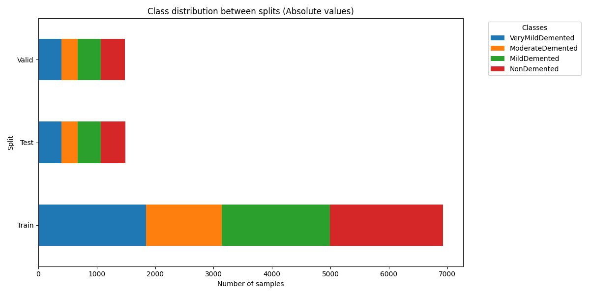
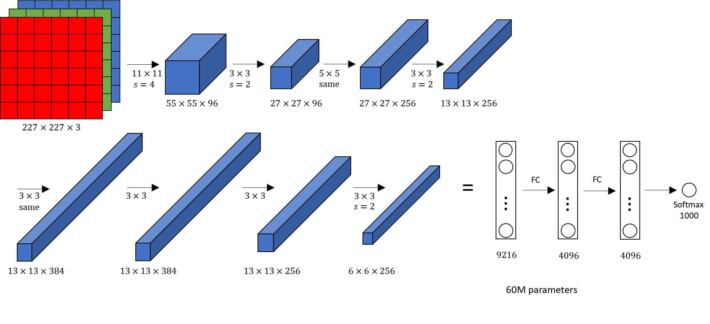
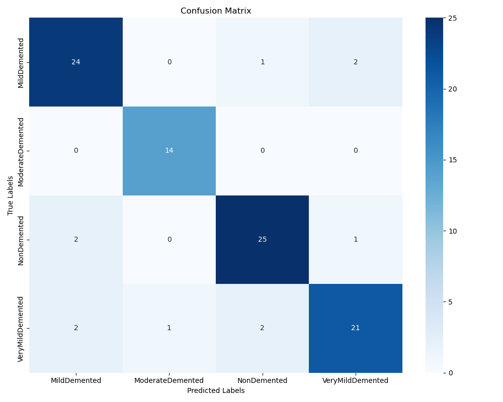

# Image Classification Alzheimer

## About

This project consists of implementing the AlexNet architecture using PyTorch to train a classification model.
This is an extension of a first project using LeNet, in search of a more robust architecture for higher resolution images.

The implementation serves as a technical showcase for medical image analysis workflows with MLOps integration.

----------------

## Dataset

- **Alzheimer's MRI Image Collection**
- Class distribution: 4 stages of Alzheimer's progression
---------------------------------
#### Class Distribution

### Class Distribution

- **Total samples:**
  - Very Mild Demented: 2,629
  - Moderate Demented: 1,862
  - Mild Demented: 2,635
  - Non Demented: 2,774

The dataset is organized using a class-folder-based structure and is split into training, testing, and validation sets (70/15/15).

An overview of the class distribution and confusion matrix is included below:

 

## Preprocessing and Data Augmentation

- **Grayscale Conversion:** MRI images are processed in grayscale.
- **Normalization:** Images are normalized with a mean of 0.5 and a standard deviation of 0.5.
- **Data Augmentation:** Utilizes Albumentations for applying random shifts, scales, rotations (shift_limit: 0.05, scale_limit: 0.05, rotate_limit: 15°) with a 20% probability, and fills empty regions with black.

## Architecture Details

**AlexNet Adaptation for MRI Analysis**

- **Input:** 32x32 grayscale MRI slices (adapted to 224x224 for improved resolution)
- **Feature Extractor:**
  - 5 convolutional blocks (each with Conv2D, BatchNorm, ReLU, and MaxPool)
  - Kernel sizes: 11, 5, 3, 3, 3 with stride and padding adjustments
- **Classifier:**
  - 3 fully-connected layers (4096 → 4096 → 4) with dropout (p=0.5)
  - Final output: 4-class probabilities

<small>(Original AlexNet architecture)</small>

## Baseline and Results

### Baseline Training Parameters

- **Learning Rate:** 0.0001 (baseline), 0.0005 (best model)
- **Epochs:** 100
- **Batch Size:** 128
- **Optimizer:** SGD with a weight decay of 0.0001 and momentum of 0.9 (or 0.85 in configuration)

After training using the baseline parameters, results were as follows:
- **F1 Score:** 0.89278
- **Validation Accuracy:** 0.88421
- **Validation Loss:** 0.3704

### Results
After adjusting the learning rate and momentum to 0.0005 and 0.85 respectively, the best model (saved at epoch 78) achieved:
- **Accuracy:** 0.98
- **Loss:** 0.04
- **F1 Score:** 0.99

Note: The model sometimes confuses Non Demented and Very Mild Demented classes, indicating an opportunity for further refinement.

## Technologies Used

- **PyTorch:** For implementing the AlexNet architecture and managing the training pipeline.
- **AWS SageMaker:** For orchestrating distributed training jobs, model checkpointing, and hyperparameter configuration.
- **Weights & Biases (W&B):** For real-time experiment tracking and logging.
- **AWS S3:** For data storage and checkpoint management.
- **Albumentations:** For extensive data augmentation.
- **MLOps Practices:** Including automated model versioning, incremental checkpoint saving, and reproducible pipelines.

## Project Highlights

- **MLOps Integration:** Utilizes AWS SageMaker, S3, and W&B for a robust and scalable machine learning workflow.
- **Data Augmentation:** Employs Albumentations to enhance generalization capabilities.
- **Comprehensive Evaluation Metrics:** Includes both accuracy and macro F1 score with visualization of the confusion matrix.
- **Code Modularity:** Demonstrates well-organized and documented code for maintainability and reusability (e.g., configurations, dataset handling, training, and inference scripts).

## Next Steps

- **Deployment:** Explore options for model deployment in a clinical setting.

