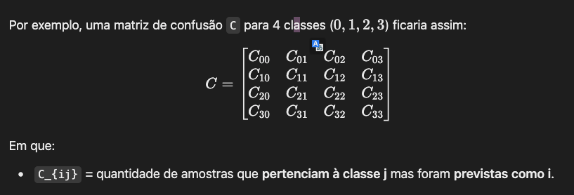

# Image Classification Alzheimer

## Sobre

This project consists of implementing the AlexNet architecture using PyTorch to train a classification model.
This is an extension of a first project using LeNet, in search of a more robust architecture for higher resolution images.

The implementation serves as a technical showcase for medical image analysis workflows with MLOps integration.

## Dataset
- **Alzheimer's MRI Image Collection**
- Class distribution: 4 stages of Alzheimer's progression
- Preprocessing pipeline:
  - Resize to 32x32 pixels
  - RGB normalization (mean=0.5, std=0.5)
  - Folder-based dataset organization
  - Data splitted by 70/15/15 for train, test validation

## Architecture Details
**AlexNet Adaptation for MRI Analysis**
- Input: 32x32 grayscale MRI slices (1 channel)
- Feature extractor:
  - 5 convolutional blocks (Conv2D + BatchNorm + ReLU + MaxPool)
  - Kernel progression: 11→5→3→3→3 with stride/padding optimization
- Classifier:
  - 3 fully-connected layers (4096→4096→4) with dropout (p=0.5)
  - Output: 4-class probabilities (Alzheimer's stages)

## Technologies Used
- **PyTorch**: Core framework for CNN implementation (AlexNet), DataLoader creation, and training loop management with CUDA acceleration
- **Sagemaker**: Orchestrates distributed training jobs with GPU instances, manages model artifacts/outputs, and handles hyperparameter configuration
- **WandB**: Tracks experiment metrics in real-time, logs confusion matrices, and stores training visualizations for performance analysis
- **MLOps**: Implements automated model versioning, S3-based checkpointing, and SageMaker pipelines for reproducible workflows
- **Training Optimization**: Features early stopping, best model selection by F1-score, and incremental checkpoint saving
- **AWS**: Leverages S3 for data storage/checkpoints and EC2 GPU instances via SageMaker for scalable model training

### Next steps
- Implement data augmentation techniques
- Detail the dataset split and class distribution in the README.md
- 

 <!-- one-versus-rest -->
 <!--  -->