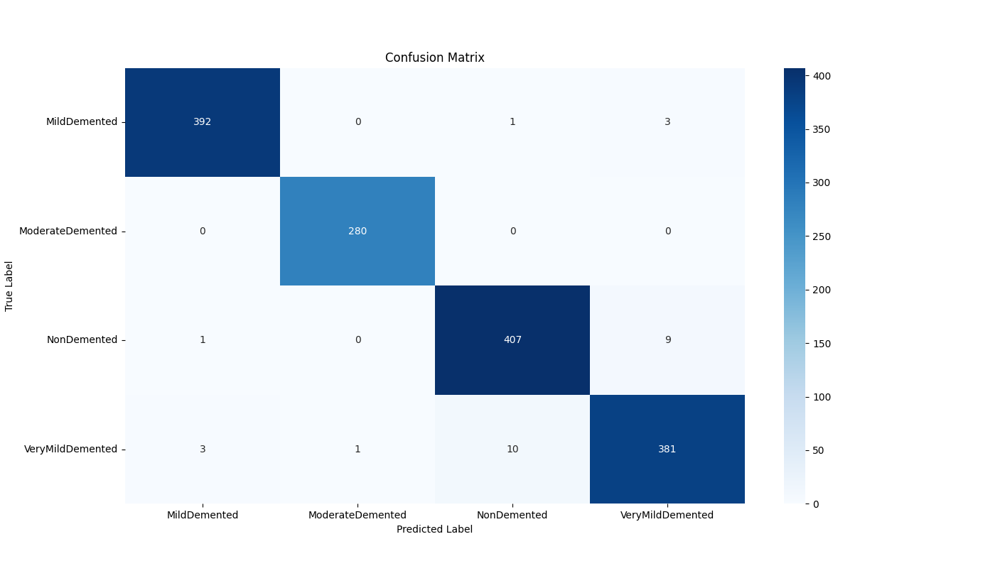

# Image Classification Alzheimer

## About

This project consists of implementing the AlexNet architecture using PyTorch to train a classification model.
This is an extension of a first project using LeNet, in search of a more robust architecture for higher resolution images.

The implementation serves as a technical showcase for medical image analysis workflows with MLOps integration.

----------------

## Dataset
- **Alzheimer's MRI Image Collection**
- Class distribution: 4 stages of Alzheimer's progression
---------------------------------
#### Class Distribution

- **Total Class Distribution:**
  - Very Mild Demented: 2,629
  - Moderate Demented: 1,862
  - Mild Demented: 2,635
  - Non Demented: 2,774

Class distribution between splits table:

  

- Preprocessing pipeline:
  - Grayscale (As MRI images ideally consists in grayscale images (tested))
  - Normalization (mean=0.5, std=0.5)
  - Class-folder-based dataset organization
  - Data splitted by 70/15/15 for train, test validation

--------------------

## Architecture Details
**AlexNet Adaptation for MRI Analysis**

<small>(Original AlexNet architecture)</small>

- Input: 32x32 grayscale MRI slices (1 channel)
- Feature extractor:
  - 5 convolutional blocks (Conv2D + BatchNorm + ReLU + MaxPool)
  - Kernel progression: 11→5→3→3→3 with stride/padding optimization
- Classifier:
  - 3 fully-connected layers (4096→4096→4) with dropout (p=0.5)
  - Output: 4-class probabilities (Alzheimer's stages)

---------------

## Baseline

We started with the architecture described above and the following parameters:
Learning rate: 0.0001
Epochs: 100
Batch size = 128

Optimizer = "SGD"
Weight decay = 0.0001
Momentum = 0.9

From these parameters, I obtained the following result in the best trained model:
f1_score 0.89278
val_acc 0.88421
val_loss 0.3704

--------------

## Results

Using the best model saved at epoch 78, I got this results:
Accuracy: 0.98
Loss: 0.04
F1 Score: 0.99

- For some reason, the model still confused about the classes NonDemented and VeryMildDemented:

#### Hyperparameters being used:
Learning Rate: 0.0005
Optimizer: SGD
Weight Decay: 0.0001
Momentum: 0.085

##### Data Augmentation

I decided to implement this techniques using **Albumentations**:
- shift_limit: 0.05 (5% percent)
- scale_limit: 0.05 (5% percent)
- rotate_limit: 15 (degrees)
- border_mode: constant (Considering the MRI images, I decided to fill the background with black, following the MRI background)
All of them with p = 20%, where p = chance to be applied 

------------------------

### Next steps

- Document the code using docstrings
- Identify the reason behind the confusion between the classes NonDemented and VeryMildDemented

-----------------

## Technologies Used
- **PyTorch**: Core framework for CNN implementation (AlexNet), DataLoader creation, and training loop management with CUDA acceleration
- **Sagemaker**: Orchestrates distributed training jobs with GPU instances, manages model artifacts/outputs, and handles hyperparameter configuration
- **WandB**: Tracks experiment metrics in real-time, logs confusion matrices, and stores training visualizations for performance analysis
- **MLOps**: Implements automated model versioning, S3-based checkpointing, and SageMaker pipelines for reproducible workflows
- **Training Optimization**: Features early stopping, best model selection by F1-score, and incremental checkpoint saving
- **AWS**: Leverages S3 for data storage/checkpoints and EC2 GPU instances via SageMaker for scalable model training
- **Albumentations**: Used to apply some transformations in random samples to apply more diversity in the original data

